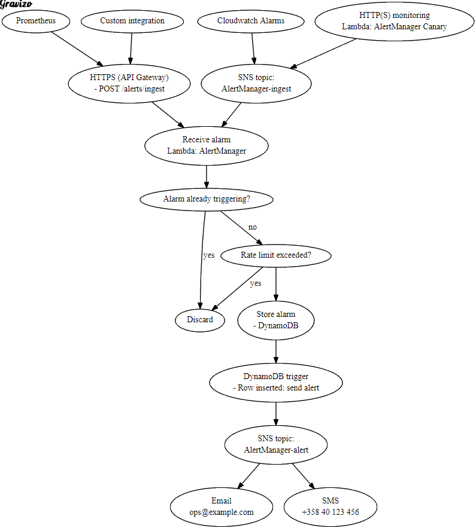

lambda-alertmanager?
--------------------

- Provides simple & reliable alerting for your infrastructure.
- Uses so little resources that it is practically free to run.
- [Monitors your web properties for being up](docs/usecase_http-monitoring.md),
  [receive alerts from Prometheus](docs/usecase_prometheus-alerting.md),
  [Amazon CloudWatch alarms](docs/usecase_cloudwatch-alerting.md), alarms via SNS topic or
  [any custom HTTP integration (as JSON)](docs/setup_custom_integration.md).
- Runs **entirely** on AWS' reliable infrastructure (after setup nothing for you to manage or fix). The compute part is Lambda,
  but we also use DynamoDB + streams (for state), IAM (for sandboxing AlertManager), API Gateway (for inbound https integrations),
  CloudWatch Events (for scheduling) and SNS (inbound alarm receiving, outbound alert delivery).
- Acknowledge -model: each separate alarm is alerted only once until it is acknowledged from UI,
  even if the same alarm is submitted again. F.ex. Prometheus sends the same alert continuously
  until the issue is resolved, but of course you want to receive the alert only once.
- Rate limiting: if shit hits the fan and your hundreds of alarms trigger all at once, you only get alerts
  for the first, say, 10 alarms. The rate limit is configurable.

Can send alerts to you (or many people) via:
--------------------------------------------

- SMS ([free: <= 100 alerts/month](https://aws.amazon.com/sns/sms-pricing/))
- Email
- Webhook
- Push to mobile device (though SMS is better in cases when you are travelling or otherwise not reachable via mobile data)
- Any combination of these (I use SMS + Email)
- Or [anything that SNS supports](https://aws.amazon.com/sns/details/) (the above are just SNS transports)

Can directly monitor:
---------------------

- http/https checks via AlertManager-Canary component (included but optional):
  checks that your web properties are up - triggers an alert if not. Can even check all your properties
  at 1 minute intervals, and runs efficiently because all the checks are executed in parallel. Tries to minimize
  false positives by retrying each failed check once before generating an alarm.

Integrates with:
----------------

- Supports receiving alerts from [Prometheus](https://prometheus.io/).
- Supports receiving alerts via SNS (= directly plugs into Amazon CloudWatch Alerts)
  or any other SNS-publishing source. For example we receive alerts from CloudWatch -> AlertManager if our
  queue processors stop processing work.
- Supports receiving alerts over https as JSON.

How to install & other docs
---------------------------

Take note of your AWS region. These docs assume you are in the `us-west-2` region.
If not, substitute your region code everywhere in these docs!

Follow these steps precisely, and you've got yourself a working installation:

1. [Set up SNS topics](docs/setup_sns.md)
2. [Set up DynamoDB](docs/setup_dynamodb.md)
3. [Set up IAM](docs/setup_iam.md)
4. [Set up AlertManager](docs/setup_alertmanager.md)
5. [Set up API Gateway](docs/setup_apigateway.md) (also includes: testing that this works)
6. (recommended) [Set up AlertManager-canary](docs/setup_alertmanager-canary.md)
7. (optional) [Set up Prometheus integration](docs/usecase_prometheus-alerting.md)
8. (optional) [Set up custom integration](docs/setup_custom_integration.md)
9. (optional) [Set up CloudWatch integration](docs/usecase_cloudwatch-alerting.md)

Diagram
-------

FAQ
---

Q: Why use this, [uptimerobot.com](https://uptimerobot.com/) is free?

A: uptimerobot.com is good, but:

- The free option only supports 5 minute rates while lambda-alertmanager supports 1 minute rates.
- I don't trust the quality of it for my production usage: I had an issue where a failed check
  after fixing stayed failed for more than 12 hours even though I manually checked that the
  endpoint works. I had to pause-and-then-resume the check right after it UptimeRobot
  reported the check as OK.
- It does mainly HTTP/HTTPS checks, while lambda-alertmanager integrates with Prometheus, Amazon CloudWatch & others as well.
- It supports free SMS messages (no delivery guarantees), but they have non-free "pro SMS" (better delivery).
  lambda-alertmanager SMSes are all "pro SMS" and free to a certain limit.
- lambda-alertmanager is simple, free, open source, runs "on premises" (in your AWS account) and should run forever
  (AWS is not going anywhere).
- That being said, lambda-alertmanager is not "dead simple" to set up and you need an AWS account. If your use
  case does not require lambda-alertmanager, you should probably choose uptimerobot. :)

Support / contact
-----------------

Basic support (no guarantees) for issues / feature requests via GitHub issues.

Paid support is available via [function61.com/consulting](https://function61.com/consulting/)

Contact options (email, Twitter etc.) at [function61.com](https://function61.com/)
