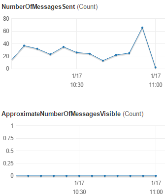
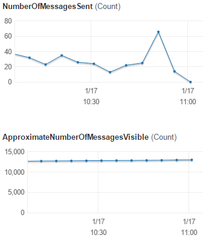

Use case: CloudWatch alerting
=============================

NOTE: this guide applies to most AWS services - not just SQS. But we'll use SQS as an example.

Let's say that you have queue workers (whether in AWS or outside of AWS) that use AWS's SQS
(Simple Queue Service). Great way to detect problems is to detect if they queue is backing up.

What does a healhy queue look like?
-----------------------------------

A healthy queue would not have many queued work items for a prolonged amount of time.
Healthy queue looks like this:

Observations:

- Items are sent to the queue pretty constantly.
- Visible messages (= messages that are not yet consumed by a worker) should be close to zero at all times.

What does an unhealhy queue look like?
--------------------------------------

Unhealthy queue gets messages sent to it faster than they are processed. Looks like this:

Observations:

- Items are sent to the queue pretty constantly.
- Visible messages (= messages that are not yet consumed by a worker) ARE NOT close to zero.

Creating a CloudWatch alarm to detect unhealthy queue
-----------------------------------------------------

Go to `CloudWatch > Alarms > Create Alarm > SQS Queue Metrics`:

- QueueName = your queue
- Metrics = `ApproximateNumberOfMessagesVisible`
- `[ Next ]`
- Name = `Queue XYZ health`
- Whenever ApproximateNumberOfMessagesVisible `is >= 5 for 1 consecutive periods`
- Period = `5 minutes`
- Action = `state = alarm => send notification to AlertManager-ingest`
- `[ Create Alarm ]`

Now when alarming condition is detected, CloudWatch uses AlertManager to dispatch the alert to you. :)

NOTE: `ApproximateAgeOfOldestMessage` is probably best metric to detect unhealthy queue that
works even in high-bandwidth queues.
`ApproximateNumberOfMessagesVisible` was mainly used as the easiest explanation.