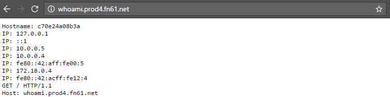
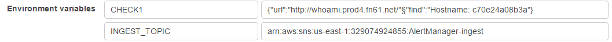
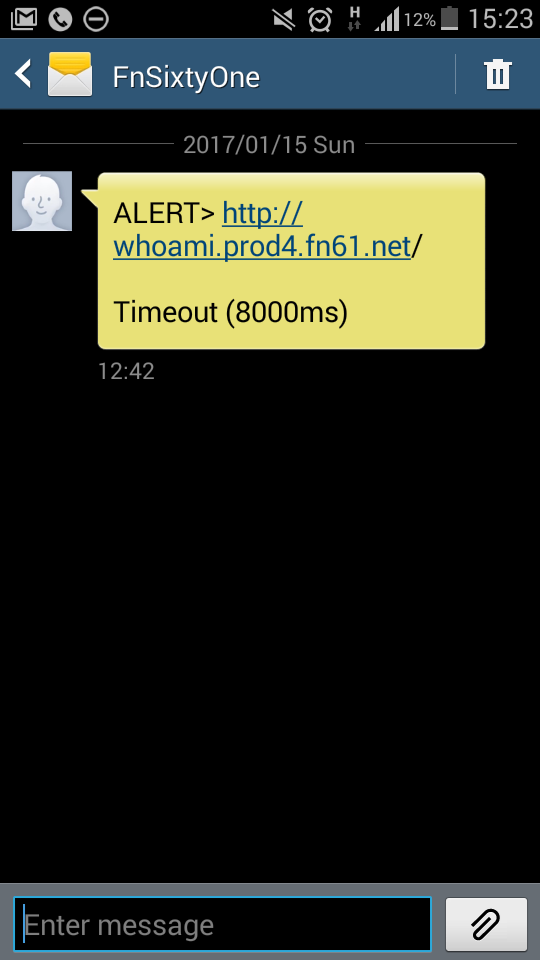

Use case: HTTP monitoring
=========================

You have an important web property that you want to monitor:



You have AlertManager-Canary installed and configured to monitor it:



So, if Canary fails to find this text from the page:

```
Hostname: c70e24a08b3a
```

It'll send an alert (to configurable receivers), for example by SMS:



And email:


