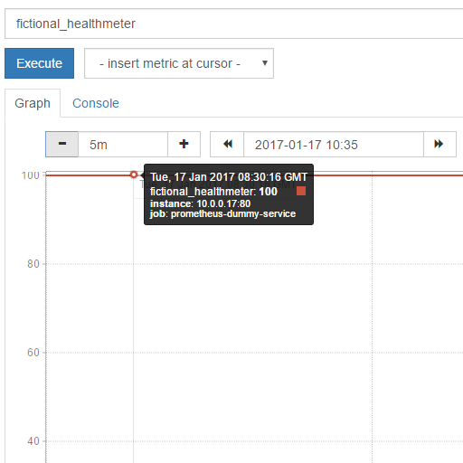
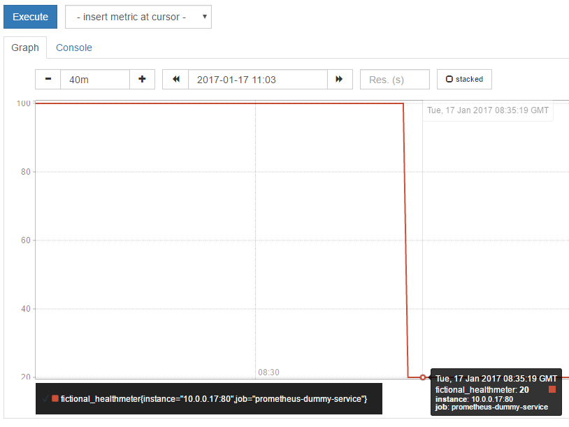

Use case: Prometheus alerting
=============================

- [Prometheus](https://prometheus.io/download/#prometheus) is the main component when talking about Prometheus.
  It monitors your services by scraping them for metrics. It allows to define alerting rules for these metrics:
  "if this metric looks like something is wrong -> raise an alert".

- However, Prometheus only **raises** alerts. It does not filter or transport them. They wisely made
  this modular and separated those concerns into another Prometheus project:
  [prom-alertmanager](https://prometheus.io/docs/alerting/alertmanager/).

- Our lambda-alertmanager is a simple replacement to prom-alertmanager that runs entirely on AWS.


Configure Prometheus to send alarms to lambda-alertmanager
----------------------------------------------------------

Edit `prometheus.conf`:

```
global:
  ... snipped

# most verbose way of specifying 'https://REDACTED.execute-api.us-east-1.amazonaws.com/prod/prometheus-alertmanager'
# Prometheus will do a HTTP POST to /prod/prometheus-alertmanager/api/v1/alerts
alerting:
  alertmanagers:
  - scheme: 'https'
    path_prefix: '/prod/prometheus-alertmanager'
    static_configs:
    - targets:
        - 'REDACTED.execute-api.us-east-1.amazonaws.com'

scrape_configs:
  ... snipped
```


Have a Prometheus-enabled service you want to monitor/graph
-----------------------------------------------------------

In our example we have a service `http://prometheus-dummy-service`.
Its Prometheus-scrapable metrics live at `http://prometheus-dummy-service/metrics`.

The response looks like this:

```
# this is fictional value
fictional_healthmeter 100

```

Prometheus-metrics can have much [richer data structure](https://prometheus.io/docs/concepts/data_model/)
than this, but this is the simplest example.

Prometheus [autodiscovers](https://prometheus.io/docs/operating/configuration/) our services,
and will scrape those metrics automatically.

Now we can graph that metric inside Prometheus:



The metric is reporting constant `100`. Which in our fictional case means everything is OK.


Configure an alert to Prometheus
--------------------------------

We'll decide that the metric `fictional_healthmeter` signals error if it dips below `50`.
Add to Prometheus' alerting rules:

```
ALERT dummy_service_down
  IF fictional_healthmeter{job="prometheus-dummy-service"} < 50
```

Now, when that happens (`fictional_healthmeter` dips to `20`):



Prometheus will submit this alarm to lambda-AlertManager - you'll get a notification via your configured transports:


Why did we replace Prometheus' AlertManager?
--------------------------------------------

- Prometheus' AlertManager would have to run on your own infrastructure - more stuff for you to operate and worry about.

- Reliability. If AlertManager goes down, you are not going to be alerted. AlertManager is in a sense
  your most critical part of your infrastructure, as you have to trust it to work when shit hits the fan.
  You don't want your customers to call you because you yourself don't know that your servers are down.
  I.e. if monitoring goes down, who monitors the monitoring? I have great confidence in letting all this
  run on AWS' well-managed environment.


But what if Prometheus goes down?
---------------------------------

Okay we learned that lambda-alertmanager is in charge of being reliable in delivering alerts. But since
Prometheus is the one that **raises these alerts**, what if Prometheus itself goes down, so there's nobody
to alert us that monitoring is down?

For this case I advise you to make AlertManager-Canary monitor your Prometheus. Just configure a http check
in Canary to alert you if Prometheus goes down. That way if AWS stays up, you'll always be notified even
if your entire cluster dies at the exact same moment.
